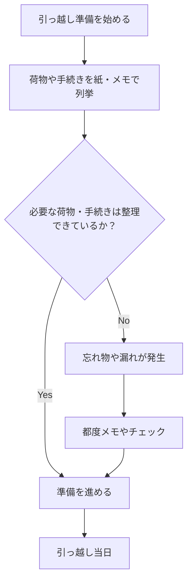
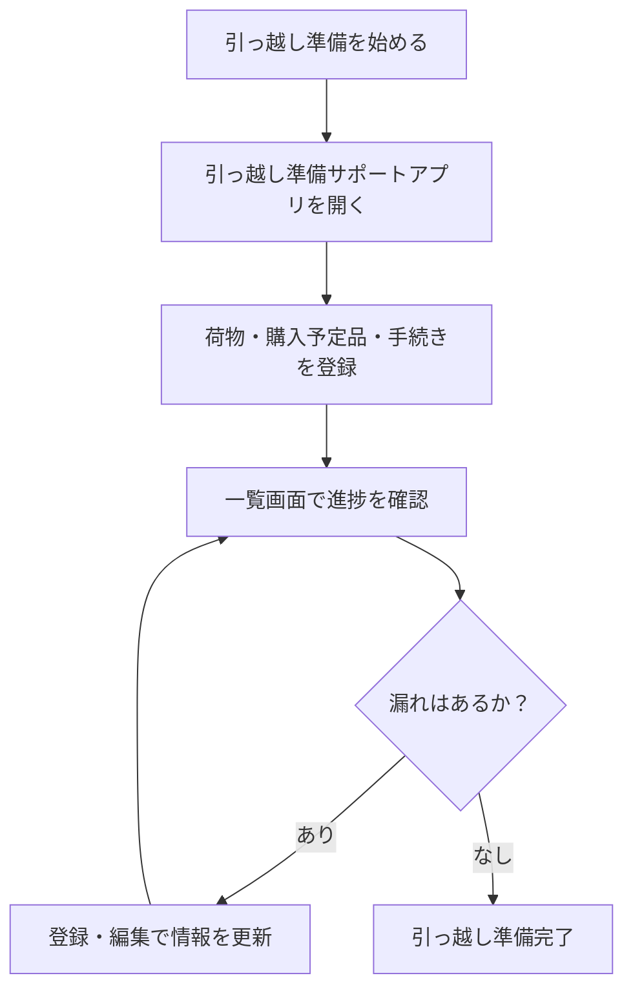
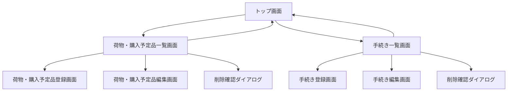

# 1. アプリ名
### **ShiftPilot**
- 命名理由
    - 引っ越しを操縦するパイロット、SES向けに少しテック感

# 2. ペルソナ
- SESとして働くエンジニア
- 引っ越しが初めて、または数年ぶりに引っ越す人
- 荷物の整理や手続き、購入予定品の管理を効率化したい
- 引っ越し準備を複数のメモやExcel、スマホのメモアプリで行っており、情報が散在している

# 3. 課題
- 荷物や購入予定品を紙やスマホのメモで管理しているため、抜け漏れが発生しやすい
- 引っ越しに必要な手続きを整理・進捗管理できない
- 準備状況の確認や振り返りに手間がかかる
- 引っ越し当日になって「買い忘れ」や「手続き漏れ」に気づくことがある

# 4. 解決
- 引っ越しに特化した荷物・購入予定品管理と手続き管理を一元化するWebアプリを作成
- 荷物・購入予定品・手続きそれぞれを登録・編集・削除できる
- 進捗状況や処理方針（持っていく/処分/購入、未対応/対応中/完了）を管理できる
- 日付順やステータスで一覧表示、漏れなく準備を進められる

# 5. 機能
- 荷物・購入予定品一覧表示
- 荷物・購入予定品の登録
- 荷物・購入予定品の編集・削除
- 引っ越し手続き一覧表示
- 手続きの登録・編集・削除
- 荷物・購入予定品・手続きの検索機能（名前・カテゴリ・期限日など）

# 6. 機能要件

## 現行の業務フロー（引っ越し準備時）

## あるべき業務フロー

## 画面遷移例

プロンプト

添付の資料を基にアプリの作成をしてください

# 添付資料内容
- RequirementsDefinition.md → 要件定義書
- high-level-design.md → 基本設計書
- image.png → 画面レイアウト図

# 出力
- 画面レイアウトの①②③④までだけをを実装して
- ControllerやService等の必要なフォルダを作成してファイルを作成して
- ワークスペースは今開いているフォルダー「moving_preparations」

# 現在の状況
- springプロジェクト作成済み
- Mavenの依存関係
    - Spring Boot Dev Tools
    - Lombok
    - Spring web
    - Thymeleaf
    - JDBC API
    - My Batis Framework
    - H2 Database

# その他
1. 作成する前にどこにどのようなフォルダ・ファイルを作成するか教えて
1. 作成個所と作成フォルダ・ファイルの確認を私が承認したら、そのまま許可を取らずに作成をしていって