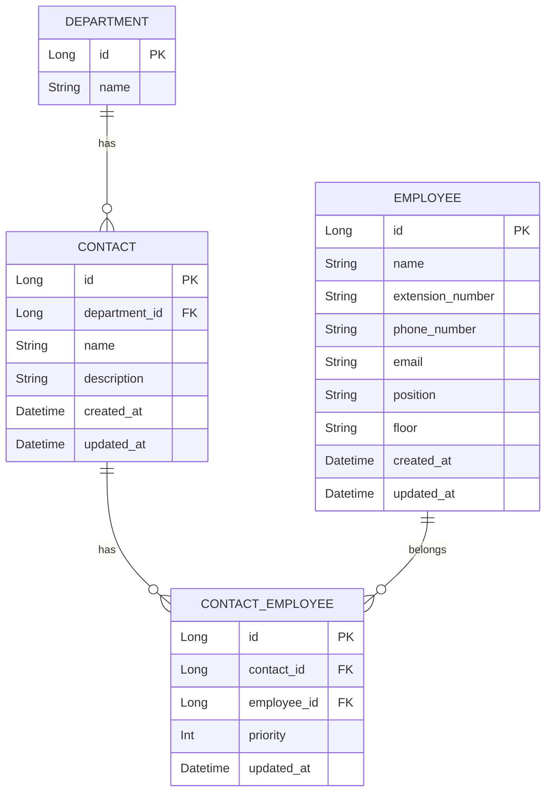

# 人事部向け社内連絡先管理アプリ 基本設計

## 1. 画面設計

### 1.1 画面レイアウト

#### ① 連絡先一覧画面（メイン画面）

- 部署・窓口単位で社内連絡先を一覧表示する
- 人事部が連絡先を検索・参照・編集する起点画面

---

#### ② 新規窓口追加画面

- 新しい連絡窓口を登録する画面
- 部署に紐づいた窓口情報を作成する

---

#### ③ 窓口所属社員一覧画面（窓口詳細）

- 特定の窓口に所属する社員を一覧表示
- 窓口情報および担当社員の管理を行う

---

#### ④ 窓口情報編集画面

- 窓口名・窓口概要を編集する画面

---

#### ⑤ 既存社員追加画面

- 既存社員を選択し、窓口に紐づける画面
- 新規社員登録画面への遷移ボタンを持つ

---

#### ⑥ 新規社員追加画面

- 社員マスタとしての社員情報を新規登録する画面

---

#### ⑦ 窓口社員編集画面

- 窓口に所属している社員の情報を編集する画面
- 窓口文脈でのみ社員情報を編集可能とする

---

### 1.2 画面遷移

#### 連絡先一覧画面
- 一覧ボタン押下  
  → 窓口所属社員一覧画面へ遷移
- 新規登録ボタン押下  
  → 新規窓口追加画面へ遷移
- 編集ボタン押下  
  → 窓口情報編集画面へ遷移
- 削除ボタン押下  
  → 確認後、削除処理を実行し一覧を再表示

#### 窓口所属社員一覧画面
- 社員編集ボタン押下  
  → 窓口社員編集画面へ遷移
- 追加ボタン押下  
  → 既存社員追加画面へ遷移
- 戻る  
  → 連絡先一覧画面へ遷移

#### 既存社員追加画画面
- 社員選択＋追加  
  → 窓口所属社員一覧画面へ遷移
- 新規社員登録ボタン押下  
  → 新規社員追加画面へ遷移

---

## 2. 入出力項目定義

### 2.1 連絡先一覧画面

#### 検索条件
- 部署名［任意］
    - テキスト入力
- 窓口名［任意］
    - テキスト入力
- 窓口概要［任意］
    - テキスト入力
- 担当者名［任意］
    - テキスト入力

#### 一覧表示項目
- 部署名
- 窓口名
- 窓口概要（省略表示）
- 担当者名（複数表示）
- 最終更新日

---

### 2.2 新規窓口追加画面

#### 項目
- 部署［必須］
    - プルダウン選択
- 窓口名［必須］
    - 1行テキストボックス
- 窓口概要［任意］
    - 複数行テキストボックス
- 登録ボタン
- 戻るボタン

#### バリデーション
- 部署、窓口名は必須

---

### 2.3 窓口所属社員一覧画面

#### 表示項目
- 窓口名
- 窓口概要
- 担当社員一覧
    - 優先度
    - 氏名
    - 内線
    - 電話番号
    - メール
    - 役職
    - 所属フロア
    - 更新日

#### 操作
- 社員編集
- 社員削除
- 社員追加

---

### 2.4 新規社員追加画面

#### 項目
- 氏名［必須］
- 内線番号［任意］
- 電話番号［任意］
- メールアドレス［任意］
- 役職［任意］
- 所属フロア［任意］
- 登録ボタン
- 戻るボタン

---

### 2.5 窓口社員編集画面

#### 項目
- 氏名
- 内線番号
- 電話番号
- メールアドレス
- 役職
- 所属フロア
- 優先度（主／副など）
- 保存ボタン
- 戻るボタン

---

## 3. 外部インターフェース

### 3.1 API一覧

#### 窓口一覧取得
- **GET /contacts**
- 検索条件に応じて窓口一覧を取得する

---

#### 窓口登録
- **POST /contacts**
- 新規窓口情報を登録する

---

#### 窓口更新
- **PUT /contacts/{id}**
- 窓口情報を更新する

---

#### 窓口削除
- **DELETE /contacts/{id}**
- 窓口情報を削除する

---

#### 社員登録
- **POST /employees**
- 社員マスタを登録する

---

#### 窓口社員更新
- **PUT /contacts/{contactId}/employees/{employeeId}**
- 窓口に所属する社員情報を更新する

---

## 4. データモデル設計

### 4.1 テーブル設計

#### 主なテーブル
- 部署テーブル
- 窓口テーブル
- 社員テーブル
- 窓口社員テーブル（関連テーブル）
    - 優先度
    - 更新日
    - 更新者
---

