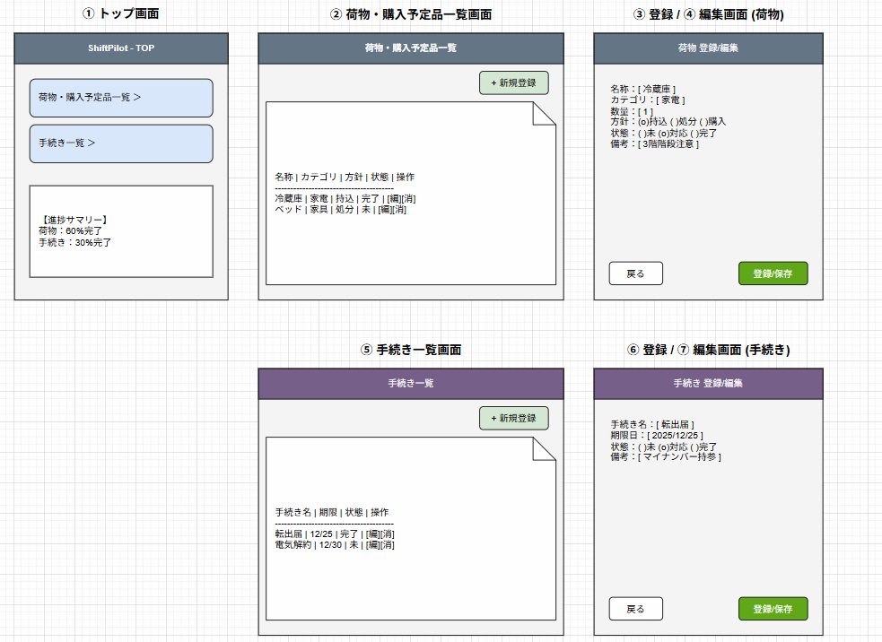
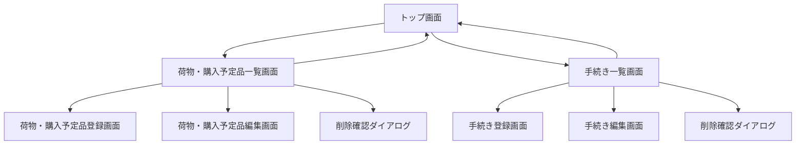
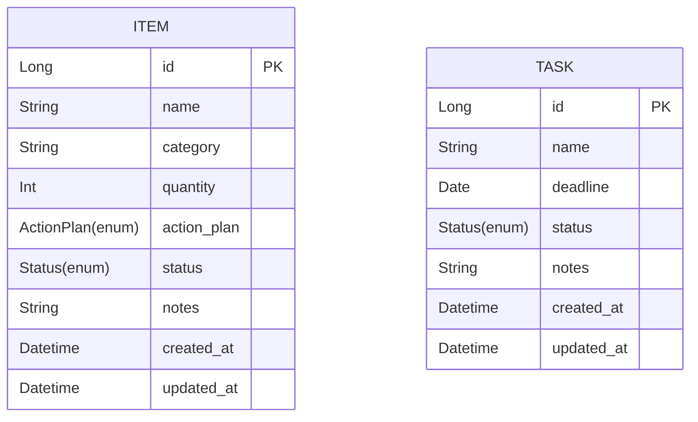

# ShiftPilot 基本設計書

## 1. 画面設計

### 1.1 画面レイアウト

## 1. 画面設計（画面レイアウト図）

### ① トップ画面

- 荷物一覧・購入予定品一覧・手続き一覧へのナビゲーション
- 全体の進捗サマリーを表示

---

#### ② 荷物・購入予定品一覧画面

- 登録済みの荷物・購入予定品を一覧表示
- ステータス（未対応・対応中・完了）、処理方針（持っていく・処分・購入）を表示
- 編集・削除・登録ボタンを配置

---

#### ③ 荷物・購入予定品登録画面

- 荷物名／カテゴリ／数量／処理方針／ステータス／備考を入力
- 登録ボタン、戻るボタン

---

#### ④ 荷物・購入予定品編集画面

- 登録済みの荷物情報を編集可能
- 保存ボタン、戻るボタン

---

#### ⑤ 手続き一覧画面

- 登録済みの引っ越し手続きを一覧表示
- ステータス（未対応・対応中・完了）を表示
- 編集・削除・登録ボタンを配置

---

#### ⑥ 手続き登録画面

- 手続き名／期限日／ステータス／備考を入力
- 登録ボタン、戻るボタン

---

#### ⑦ 手続き編集画面

- 登録済みの手続きを編集可能
- 保存ボタン、戻るボタン

---

### 1.2 画面遷移

## 2. 入出力項目定義

### 2.1 荷物・購入予定品一覧画面

#### 検索条件
- 荷物名／購入予定品名［任意］
- カテゴリ［任意］
- ステータス［任意］
- 処理方針［任意］

#### 一覧表示項目
- 荷物名／購入予定品名
- カテゴリ
- 数量
- 処理方針
- ステータス
- 備考
- 更新日

---

### 2.2 荷物・購入予定品登録画面

#### 項目
- 荷物名／購入予定品名［必須］
- カテゴリ［任意］
- 数量［任意］
- 処理方針（持っていく／処分／購入）［必須］
- ステータス（未対応／対応中／完了）［必須］
- 備考［任意］
- 登録ボタン
- 戻るボタン

#### バリデーション
- 荷物名／処理方針／ステータスは必須

---

### 2.3 手続き一覧画面

#### 一覧表示項目
- 手続き名
- 期限日
- ステータス（未対応／対応中／完了）
- 備考
- 更新日

#### 操作
- 登録
- 編集
- 削除

---

### 2.4 手続き登録画面

#### 項目
- 手続き名［必須］
- 期限日［任意］
- ステータス［必須］
- 備考［任意］
- 登録ボタン
- 戻るボタン

#### バリデーション
- 手続き名／ステータスは必須

---

## 3. 外部インターフェース

### 3.1 API一覧

#### 荷物一覧取得
- **GET /items**
- 検索条件に応じて荷物・購入予定品一覧を取得

#### 荷物登録
- **POST /items**
- 新規荷物・購入予定品を登録

#### 荷物更新
- **PUT /items/{id}**
- 荷物情報を更新

#### 荷物削除
- **DELETE /items/{id}**
- 荷物情報を削除

#### 手続き一覧取得
- **GET /tasks**
- 手続き一覧を取得

#### 手続き登録
- **POST /tasks**
- 新規手続きを登録

#### 手続き更新
- **PUT /tasks/{id}**
- 手続き情報を更新

#### 手続き削除
- **DELETE /tasks/{id}**
- 手続きを削除

---

## 4. データモデル設計

### 4.1 テーブル設計

#### 主なテーブル
- 荷物・購入予定品テーブル（ITEM）
- 手続きテーブル（TASK）

#### enum設定
- ActionPlan
  - TAKE (持っていく)
  - DISCARD (処分)
  - BUY (購入)

- Status
  - NOT_STARTED (未対応)
  - IN_PROGRESS (対応中)
  - COMPLETED (完了)

## 5. Controller / Service / Repository構成案

### 5.1 Controller

- **ItemController**  
  荷物・購入予定品の一覧表示、登録、編集、削除

- **TaskController**  
  手続き一覧表示、登録、編集、削除

---

### 5.2 Service

- **ItemService**  
  ビジネスロジック（ステータス更新、進捗管理）

- **TaskService**  
  手続き管理ロジック

---

### 5.3 Repository

- **ItemRepository**  
  ITEMテーブルへのCRUD

- **TaskRepository**  
  TASKテーブルへのCRUD
